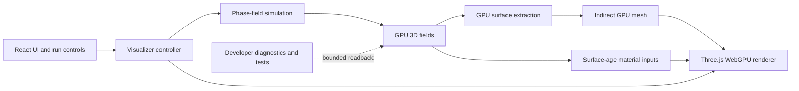
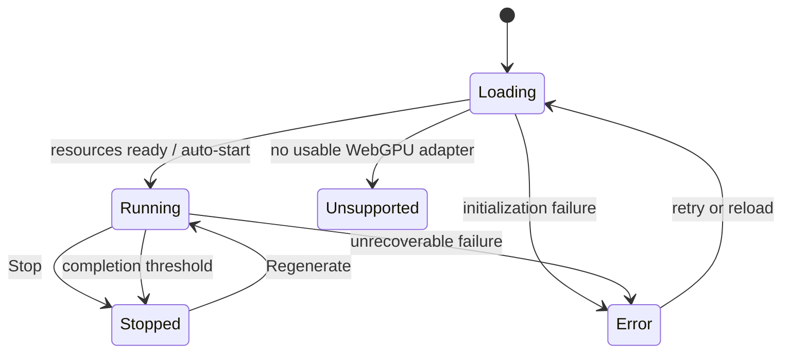

# Architecture

## Overview

The application is a client-side WebGPU simulation and renderer wrapped in a small React interface. Express serves production assets but does not participate in simulation or generation.



## Runtime ownership

### React application

Owns:

- Loading and unsupported states.
- Public action label and accessibility.
- Developer-panel mounting in development builds.
- Canvas host sizing and high-level error presentation.

Does not own:

- The animation loop.
- GPU field objects.
- Per-frame camera or mesh state.
- Simulation stepping.

### Visualizer controller

An imperative controller attached to one canvas owns:

- Three.js renderer, scene, camera, controls, environment, and light.
- Simulation, extraction, and material subsystem instances.
- Run state transitions.
- Frame scheduling and extraction cadence.
- Resource reset, disposal, resize, visibility, and device-loss handling.

React communicates with the controller through a narrow command/event interface rather than reaching into Three.js objects.

### Simulation subsystem

Owns:

- Validated simulation configuration.
- Deterministic run seed.
- Phase and chemical-potential ping-pong resources.
- Solidification-time field.
- TSL compute nodes and uniform state.
- Boundary conditions, time integration, and completion metrics.

### Extraction subsystem

Owns:

- Marching-cubes lookup data.
- Active-cell and triangle-count buffers.
- Prefix-sum scratch buffers.
- Vertex, normal, surface-age, and indirect-draw buffers.
- Capacity and overflow state.

### Rendering subsystem

Owns:

- Buffer geometry bound to compute-generated storage buffers.
- Physical node material and oxide mapping.
- Black background, HDRI environment, and directional light.
- Tone mapping, exposure, antialiasing, shadows, and camera controls.

## Conceptual interfaces

Keep public TypeScript interfaces small and serializable where practical.

```ts
type RunState = 'loading' | 'running' | 'stopped' | 'unsupported' | 'error';

interface VisualizerCommands {
  stop(): void;
  regenerate(): void;
  dispose(): void;
}

interface VisualizerEvent {
  state: RunState;
  reason?: 'manual' | 'complete' | 'device-lost' | 'failure';
}

interface EnvironmentPreset {
  id: string;
  hdriUrl: string;
  environmentRotation: number;
  exposure: number;
  sunDirection: [number, number, number];
  sunIntensity: number;
  sunColor: string;
}
```

Simulation configuration and diagnostics must use separate types so developer-only options cannot leak accidentally into the public control API.

## GPU resource model

Initial single-crystal resources:

| Resource               | Intended representation      | Purpose                       |
| ---------------------- | ---------------------------- | ----------------------------- |
| Phase A/B              | 3D floating storage textures | Ping-pong phase fraction      |
| Chemical potential A/B | 3D floating storage textures | Ping-pong transport field     |
| Solidification time    | 3D floating storage texture  | First threshold-crossing time |
| Extraction counts/scan | Storage buffers              | Active-cell compaction        |
| Mesh attributes        | Storage buffer attributes    | GPU-generated surface         |
| Indirect draw data     | Indirect storage buffer      | Triangle draw count           |

Use 32-bit floats for the scientific baseline. A lower-precision path requires separate numerical evidence and a recorded decision.

The future cluster model may add per-grain phase/order fields and orientation data. Do not allocate or design those resources into the first milestone beyond keeping subsystem boundaries extensible.

## Frame scheduling

While running, a frame performs a bounded amount of work:

1. Determine the permitted simulation-step batch.
2. Dispatch phase and chemical-potential updates.
3. Update completion summaries without full-field readback.
4. At the configured cadence, classify and extract the current isosurface.
5. Update render uniforms and render the latest valid mesh.

Render cadence and extraction cadence may differ. Simulation batching may adapt to measured GPU time, but must not change the numerical time step or equations silently.

Stopped runs dispatch no solver or extraction work. Camera and rendering remain active for inspection.

The transition into stopped state is ordered: prevent new solver batches, perform one final extraction from the latest valid field, then publish `stopped`. If that extraction fails, retain the last valid mesh and publish an error reason through diagnostics rather than drawing invalid geometry.

## Run lifecycle



Regenerate resets all run-scoped fields, counters, random state, extraction counts, and material age state. Reuse stable pipelines and environment resources when safe.

## Failure handling

- Report unsupported WebGPU explicitly.
- Label GPU resources and compute stages for useful validation messages.
- Detect non-finite summaries and extraction overflow before presenting corrupt output.
- On overflow, keep the last valid mesh, stop the run, and expose details in developer diagnostics.
- Treat device loss as a stopped/error state; do not pretend the run can resume from unavailable GPU state.
- Dispose all listeners, controls, textures, buffers, and renderer-owned resources on teardown.
