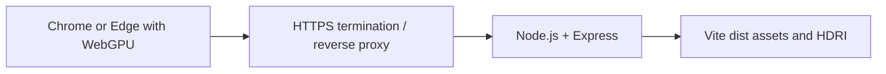

# Development and Deployment

## Local Windows workflow

The primary development environment is Windows with PowerShell, Node.js, npm, the local Codex in-app browser, and a hardware WebGPU adapter. Current Chrome and Edge remain the public browser support floor, but reference local hardware tests run in the in-app browser.

Use Vite for local development. `http://localhost` is treated as a secure context for WebGPU development. Do not require local TLS for the standard workflow.

Development startup should report:

- Application version/commit when available.
- Three.js revision.
- Browser WebGPU availability.
- Adapter information available through supported APIs.
- Selected simulation configuration in developer mode.

Keep automation in Node/TypeScript or cross-platform package scripts. Avoid Bash-only command chains and PowerShell-only build logic.

During milestone 0A, the scaffolding agent may select the latest stable, non-prerelease compatible Node.js and supporting toolchain releases. Record and enforce the selected Node.js version, pin dependency versions exactly, use npm, and commit `package-lock.json`. Three.js is fixed separately at `0.185.0` (r185).

## Production shape

The production application remains stateless and client-computed:

Express does not run the crystal solver and requires no database, queue, session store, or user storage.

## Express responsibilities

- Serve the built Vite application from an absolute path.
- Serve content-hashed JS/CSS assets and versioned HDRI files with long immutable caching.
- Keep the HTML application shell uncached or revalidated so deployments become visible promptly.
- Provide SPA fallback only for intended application routes.
- Provide a lightweight health endpoint such as `/healthz`.
- Apply compression where it benefits text assets.
- Emit useful startup and request-error logs without noisy per-frame client telemetry.
- Handle termination signals and stop accepting new connections cleanly.
- Bind to a private/local interface behind the reverse proxy where practical.

## Ubuntu EC2

Intended production environment:

- Supported Ubuntu LTS release.
- The same pinned Node.js runtime selected during scaffolding.
- Application process managed by `systemd` with restart-on-failure and production environment variables.
- Security group exposes only required public HTTP/HTTPS and restricted administration access.
- HTTPS terminates before requests reach the public application origin.

The exact TLS/reverse-proxy mechanism is deferred. Acceptable designs must provide a normal trusted HTTPS origin because remote WebGPU is restricted to secure contexts.

## Asset handling

The user-provided repository-root `hdri.jpg` may be one of the largest static assets.

- Preserve the root file unchanged; do not substitute or download a different asset.
- Prefer a browser-appropriate compressed representation supported by the selected Three.js path.
- Use a versioned URL so it can be cached aggressively.
- Preload only the initial required environment.
- Treat future HDRIs as environment presets with matching exposure and directional-light metadata.

## Deployment validation

After deployment:

- Confirm `/healthz` succeeds.
- Confirm the HTML references the intended hashed assets.
- Confirm HTTPS and secure-context status.
- Confirm `navigator.gpu` and adapter creation on a supported client.
- Run the production browser smoke test: load, auto-start, Stop, Regenerate, orbit, and completion fixture.
- Verify HDRI and static-asset caching headers.
- Verify a process restart does not affect client-generated state beyond normal page reload behavior.

## Not required initially

- Autoscaling, multi-instance sessions, Redis, database, object-storage uploads, WebSockets, server-side simulation, or user authentication.
- CDN or load balancer until traffic or operational needs justify it.
- Automated infrastructure provisioning before the application passes local numerical, visual, and performance gates.
